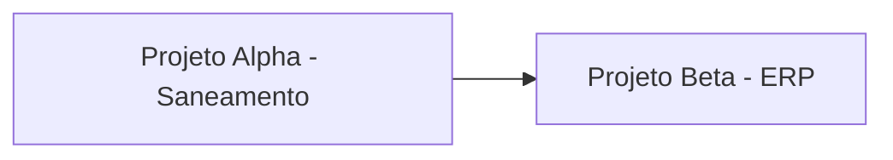

# 🧠 HOME

Dashboard central. Tudo que precisa de visão se materializa aqui via Dataview.

## Hoje

> [!info] Daily de hoje
> ```dataview
> LIST
> FROM "daily"
> WHERE file.name = dateformat(date(today), "yyyy-MM-dd")
> ```

## Atalhos

- 🚀 [[projects-index|Projetos]]
- 👥 [[stakeholders-index|Stakeholders]]
- ⚖️ [[decisions-index|Decisões]]
- 🗣️ [[meetings-index|Reuniões]]
- 🏛️ [[areas-index|Áreas]]
- 📖 [[resources-index|Recursos]]

## Carreira (LOCAL APENAS — não está no GitHub)

🔒 Estes arquivos existem somente no seu Obsidian local. Nunca commitados.

- [[70-career/career-map|Mapa de carreira]]
- [[70-career/objectives|Objetivos do ano]]
- [[70-career/political-map|Mapa político]]
- [[70-career/wins-and-narrative|Wins & Narrativa]]
- [[70-career/skills-matrix|Matriz de competências]]
- [[70-career/performance-reviews|Performance reviews]]

## Projetos ativos por prioridade

```dataview
TABLE status, priority, next_milestone AS "Próximo marco", next_milestone_date AS "Data"
FROM "20-projects"
WHERE status != "completed" AND status != "archived"
SORT priority ASC, next_milestone_date ASC
```

## Reuniões da semana

```dataview
TABLE meeting_type AS "Tipo", participants AS "Participantes"
FROM "50-meetings"
WHERE date >= date(today) - dur(7 days)
SORT date DESC
```

## Sinais de atenção

### Stakeholders sem interação há mais de 60 dias

```dataview
TABLE last_interaction AS "Última interação", relation AS "Relação", health
FROM "30-stakeholders"
WHERE archived != true 
  AND (last_interaction = null OR date(last_interaction) < date(today) - dur(60 days))
SORT last_interaction ASC
```

### Projetos sem update há mais de 14 dias

```dataview
TABLE updated AS "Última atualização", status, priority
FROM "20-projects"
WHERE status != "completed" 
  AND status != "archived"
  AND date(updated) < date(today) - dur(14 days)
SORT updated ASC
```

### ADRs em proposta há mais de 30 dias

```dataview
TABLE created AS "Aberto em", scope AS "Escopo", proposed_by AS "Proposto por"
FROM "60-decisions"
WHERE status = "proposed" 
  AND date(created) < date(today) - dur(30 days)
SORT created ASC
```

## Mapa de portfólio



> Atualize manualmente quando dependências entre projetos mudarem.

## Atividade recente do Devin

> Devin atualiza esta seção ao mergeear PRs relevantes.

- _(vazio inicialmente)_
