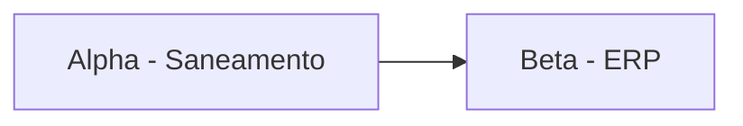

# 🚀 Projetos

## Ativos por prioridade

```dataview
TABLE status, priority, owner_role AS "Papel", next_milestone AS "Próximo marco", next_milestone_date AS "Data"
FROM "20-projects"
WHERE status != "completed" AND status != "archived"
SORT priority ASC, next_milestone_date ASC
```

## Por horizonte

### Curto prazo (até 3 meses)

```dataview
LIST
FROM "20-projects"
WHERE horizon = "short" AND status != "completed" AND status != "archived"
```

### Médio prazo (3–9 meses)

```dataview
LIST
FROM "20-projects"
WHERE horizon = "medium" AND status != "completed" AND status != "archived"
```

### Longo prazo / estratégicos

```dataview
LIST
FROM "20-projects"
WHERE horizon = "long" AND status != "completed" AND status != "archived"
```

## Projetos com dependências cruzadas

```dataview
TABLE dependencies AS "Depende de", blocks AS "Bloqueia"
FROM "20-projects"
WHERE (dependencies AND length(dependencies) > 0) OR (blocks AND length(blocks) > 0)
```

## Concluídos recentes

```dataview
LIST
FROM "20-projects"
WHERE status = "completed"
SORT updated DESC
LIMIT 10
```

## Mapa de portfólio (manual)


